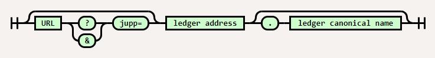
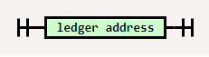
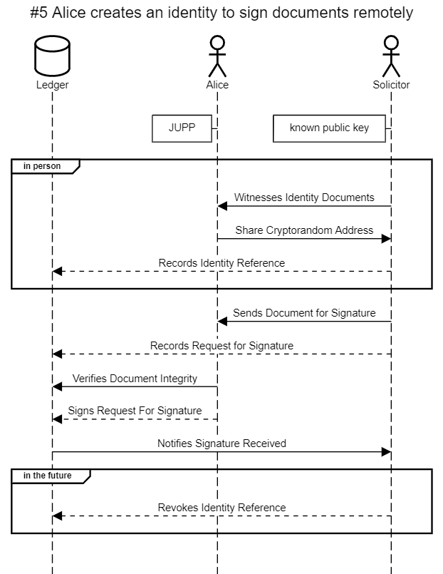
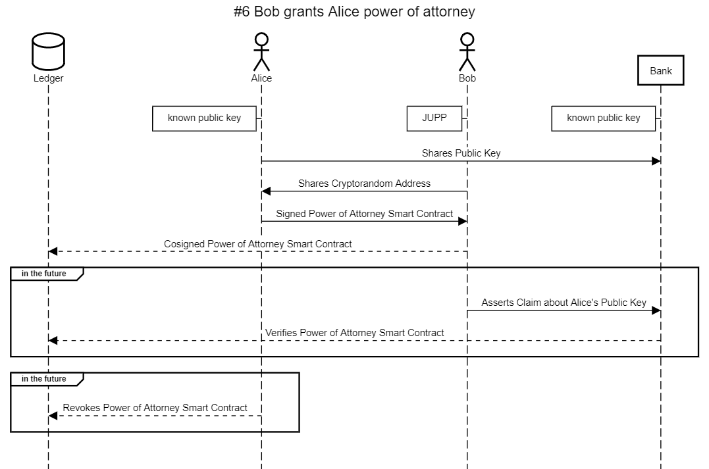
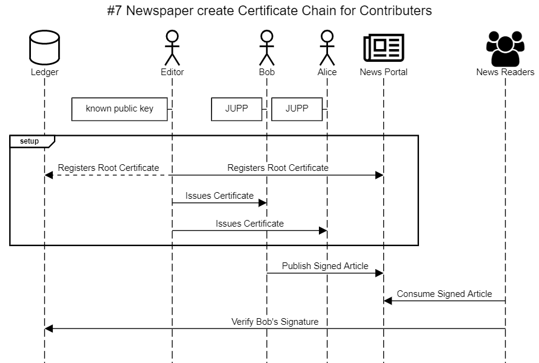
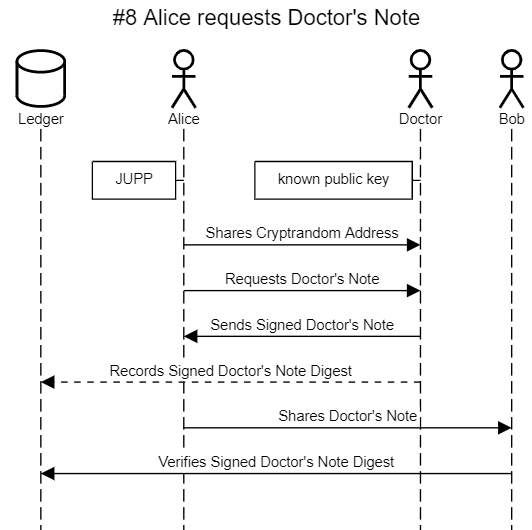
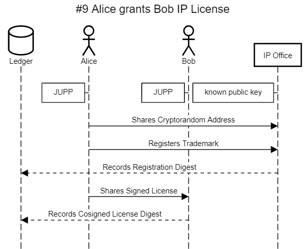
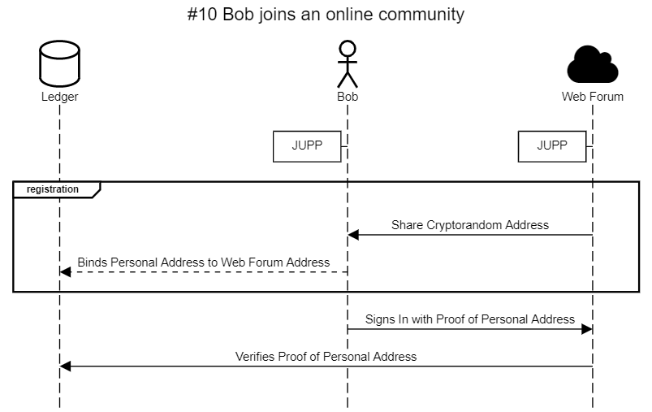
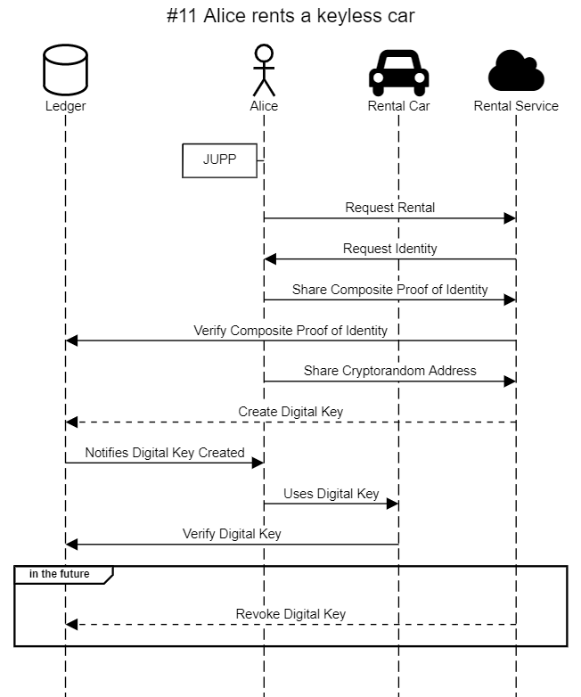

# JUPP - Just Useful Personal Privacy

A Protocol For Digital Native Consent

The Digital Contract Developers Consortium

---

1. What is JUPP?

2. JUPP-SP - The JUPP Sharing Protocol
    1. JUPP-SP - Address Format
    2. JUPP-SP - Usage Scenarios
3. JUPP-ID

---

### What is JUPP?

JUPP is a initiative to promote consent in digital relationships. The initiative includes the promotion of JUPP-SP; the JUPP Sharing Protocol, and JUPP-ID; devices that make JUPP-SP easy to use for end users.

### JUPP-SP - The JUPP Sharing Protocol

JUPP-SP facilitates the binding of cryptorandom addresses into consenting data relationships. When a user shares an address using JUPP-SP, consent to use the address is automatically granted to the receiver.

#### JUPP-SP - Address Format

A JUPP address is preferrably shared within a URL. The JUPP protocol doesn't care what the URL's own protocol is, provided it permits HTTP style query parameters. Although not indicated in the railroad diagram, it is not important the position of the `jupp=` parameter within the query string.

For a receiver application to be JUPP compatible it must understand at a minimum JUPP-SP-FF in so far as it can successfully extract the `ledger address` value and `ledger canonical name` value. Correctly implemented, a parser for JUPP-SP-FF will automatically support JUPP-SP-SF and JUPP-SP-CN forms.

*fig. JUPP-SP-FF full form JUPP address grammar*

*fig. JUPP-SP-SF short form JUPP address grammar*

*fig. JUPP-SP-CN context known JUPP address grammar*

The rational for preferring embedding a ledger address within a URL is that doing so integrates efficiently and in many cases natively where common sharing strategies such as NFC Forum NDEF URI Records and Denso Wave QR code are practical.

To generate a share a JUPP address, the protocol stipulates that:

- A JUPP address can only be shared one time.
- A JUPP address preferrably includes a canonical name indicating which ditributed ledger the sharer expects the receiver to use.
- When a ledger canonical name is present, the receiver of a JUPP address is responsible for resolving it.

A valid JUPP-SP-FF formatted address:

`https://myjupp.io?jupp=1HraG2J2A3L2JA8z8VKp97fALNpvqpQHzn.dcdc`

A valid JUPP-SP-SF formatted address:

`1HraG2J2A3L2JA8z8VKp97fALNpvqpQHzn.dcdc`

A valid JUPP-SP-CN formatted address:

`1HraG2J2A3L2JA8z8VKp97fALNpvqpQHzn`

#### JUPP-SP - Usage Scenarios

To understand the composition of a relationship between addresses let's look at some example interactions.

*Note: In the following sequence diagrams, a dashed lines indicates that an activity is or includes a ledger write transaction which on some platforms will incur a fee.*

**#1 Alice meets Bob, Bob requests data from Alice:**

In this scenario, Alice shares a JUPP address with Bob, and Bob requests data using the address to communicate with Alice. A distributed ledger records the proofs of interaction and consent, but does not record any personally identifying information.

**#2 Alice collects an e-receipt:**

In this scenario, Alice shares a JUPP address with a retailer, and the retailer records the receipt where Alice can use the JUPP address' private key to retrieve it.

**#3 Bob collects loyalty points from two cooperating retailers**

In this scenario, Bob collects loyalty points from two cooperating retailers. Each shared JUPP address is unique.

**#4 Bob attests to his identity with PKI**

In this scenario, Bob has requested that two organisations sign claims about his personal data. For brevity, it can be assumed that Bob has previously consented explicitly or by default because of the nature of his relationship with any organisation to the storage of personal data by those organisations.

**#5 Alice creates an identity to sign documents remotely**

In this scenarion, a solicitor creates a identity for Alice to use to sign electronic documents. At a later time, the solicitor is able to automatically or manually revoke the ability to Alice to use the identity. Alternatively the identity may remain intact allowing Alice to utilise it as an instrument of self sovereign identity.

**#6 Bob grants Alice power of attorney**

In this scenario, Alice grants Bob power of attorney using a public key relationship with a bank. When Bob asserts claims about the public key, the bank can verify that the owner of the private key matching Alice's public key has granted Bob power of attorney.

**#7 Newspaper create Certificate Chain for Contributers**

In this scenario, a newspaper editor uses a public key to create a root certificate that in turn creates identites contributors can use to sign published content. Consumers of the content can freely verify the authenticity of the signed content.

**#8 Alice requests Doctor's Note**

In this scenario, Alice asks her doctor to digitally sign a Doctor's Note that she can share with colleague Bob.

**#9 Alice grants Bob IP License**

In this scenario, Alice registers a trademark with a relevant intellectual property office. Bob uses the trademark under digital license verifiable on the public ledger.

**#10 Bob join an online community without sharing personal data**

In this scenario, Bob uses a JUPP identity to join an online community. At any time later Bob may explicitly consent to share personal data storing only evidence within the public ledger. This mechanism for sharing personal data simplifies the process of personal data storage as it carries effective proof of attached rights and responsibilities.

Note: In this version of a Single Sign On scenario, the user potentially pays a transaction fee for sign-up. And while it can easily work with the Web Forum paying, this variant of the strategy provides a built in anti-spam mechanism.

**#11 Alice rents a keyless car**

In this scenario, Alice uses a JUPP relationship to rent a keyless car. Alice uses her JUPP-ID to access the vehicle, and her self sovereign identity graph to arrange the rental digitally and in advance.

