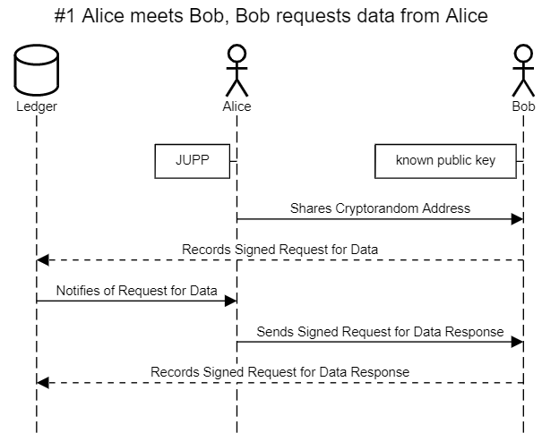
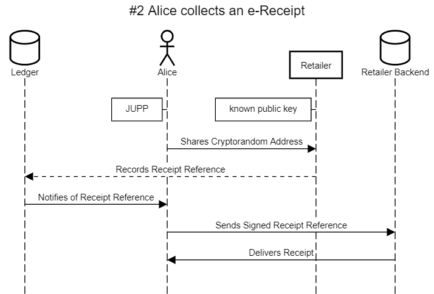
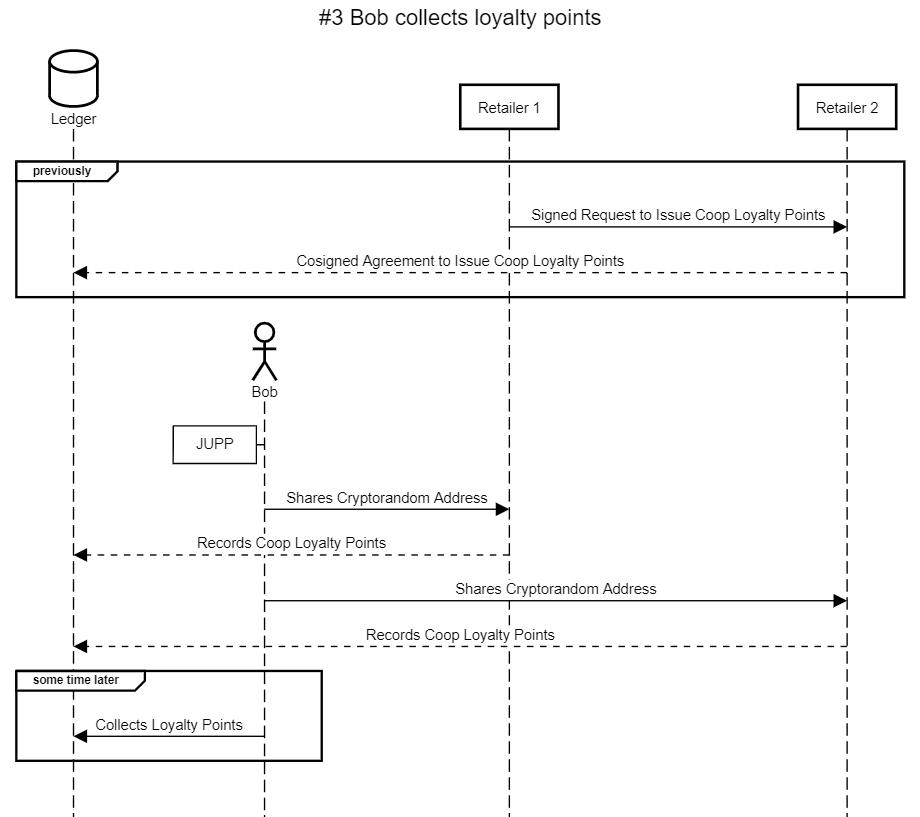
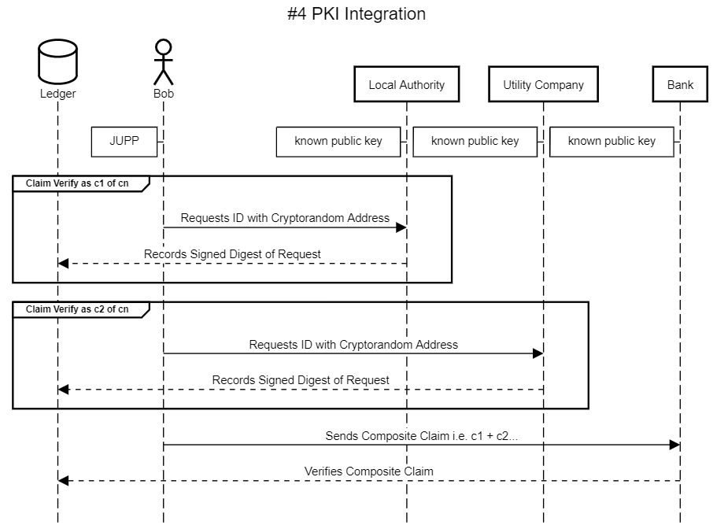

# JUPP - Just Useful Personal Privacy

A Protocol For Digital Native Consent

The Digital Cooperative Development Consortium

---

### What is JUPP?

JUPP is a initiative to promote consent in digital relationships. The initiative includes the promotion of JUPP-SP; the JUPP Sharing Protocol, and JUPP-ID; devices that make JUPP-SP easy to use for end users.

### JUPP-SP - The JUPP Sharing Protocol

JUPP-SP facilitates the binding of cryptorandom addresses into consenting data relationships. When a user shares an address using JUPP-SP, consent to use the address is automatically granted to the receiver.

To understand the composition of such a relationship between addresses let's look at some example interactions.

*Note: In the following sequence diagrams, a dashed lines indicates that an activity is or includes a ledger transaction that might incur a fee.*

**#1 Alice meets Bob, Bob requests data from Alice:**

In this scenario, Alice shares a cryptorandom address with Bob, and Bob requests data using the address to communicate with Alice. A distributed ledger records the proofs of interaction and consent, but does not record any personally identifying information.



**#2 Alice collects an e-receipt:**

In this scenario, Alice shares a cryptorandom address with a retailer, and the retailer records the receipt where Alice can use the address' private key to retrieve it.



**#3 Bob collects loyalty points from two cooperating retailers**

In this scenario, Bob collects loyalty points from two cooperating retailers. Each shared cryptorandom address is unique.



**#4 Bob attests to his identity with PKI**




**#5 Alice creates an identity to sign documents remotely**


---

Diagram Source:
```
title #1 Alice meets Bob, Bob requests data from Alice

database Ledger
actor Alice
actor Bob

parallel 
box left of Alice: JUPP
box left of Bob: known public key
parallel off

Alice->Bob: Shares Cryptorandom Address
Bob-->Ledger: Records Signed Request for Data
Ledger->Alice: Notifies of Request for Data
Alice->Bob: Sends Signed Request for Data Response
Bob-->Ledger: Records Signed Request for Data Response
```


```
title #2 Alice collects an e-Receipt

database Ledger
actor Alice
participant Retailer
database Retailer Backend

parallel
box left of Alice: JUPP
box left of Retailer: known public key
parallel off

Alice->Retailer: Shares Cryptorandom Address
Retailer-->Ledger: Records Receipt Reference
Ledger->Alice: Notifies of Receipt Reference
Alice->Retailer Backend: Sends Signed Receipt Reference
Retailer Backend->Alice: Delivers Receipt
```


```
title #3 Bob collects loyalty points

database Ledger
actor Bob
participant Retailer 1
participant Retailer 2
group previously
Retailer 1->Retailer 2:Signed Request to Issue Coop Loyalty Points
Retailer 2--> Ledger:Cosigned Agreement to Issue Coop Loyalty Points
end

parallel 
create Bob
box left of Bob:JUPP
parallel off
Bob->Retailer 1:Shares Cryptorandom Address
Retailer 1-->Ledger:Records Coop Loyalty Points
Bob->Retailer 2:Shares Cryptorandom Address
Retailer 2-->Ledger:Records Coop Loyalty Points

group some time later
Bob->Ledger: Collects Loyalty Points
end
```

```

title #4 PKI Integration

database Distributed Ledger
actor Bob
participant Local Authority
participant Utility Company
participant Bank

group Claim Verify as c1 of cn
Bob->Local Authority:Requests ID with Cryptorandom Address
Local Authority-->Distributed Ledger:Records Signed Digest of Request
end
group Claim Verify as c2 of cn
Bob->Utility Company:Requests ID with Cryptorandom Address
Utility Company-->Distributed Ledger: Records Signed Digest of Request
end
Bob->Bank:Sends Composite Claim i.e. c1 + c2...
Bank-->Distributed Ledger: Verifies Composite Claims
```